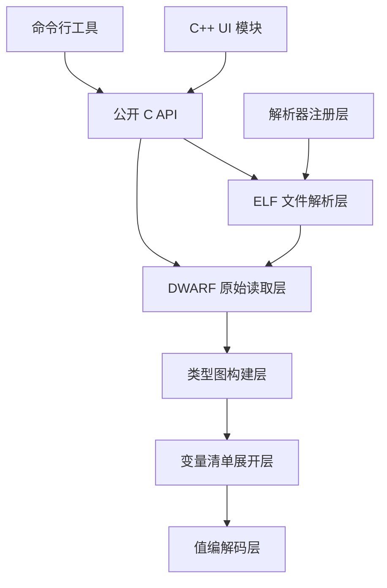
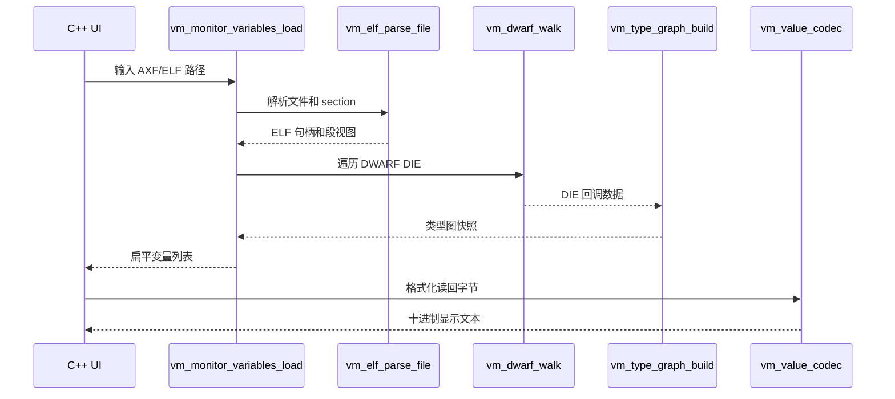

# ELF 解析模块详细架构设计

## 模块定位

`vm_elf_parser` 是变量监控与标定工具中的独立 C 模块，负责从 ELF/AXF 文件中解析可监控、可标定的变量清单。模块不依赖 Qt，也不依赖通信模块；既可以被 C++ UI 通过函数接口调用，也可以通过命令行工具独立运行。

模块输入是 ARM ELF32/AXF 文件内容或文件路径。模块输出是变量名、地址、字节数、基础类型、读写属性、位域信息，以及能够用于十进制显示和十进制写入的值编解码信息。

## 架构目标

1. ELF/AXF 文件解析、DWARF 调试信息解析、变量展开和值编解码全部封装在 C 模块内。
2. C++ UI 不直接解析 ELF、DWARF 或变量类型，只通过 `include/` 暴露的函数接口读取结果。
3. 模块可以用 `Makefile` 独立编译成静态库和命令行可执行文件。
4. 变量监控和标定基于实际变量地址，不再要求 MCU 工程提供中间转存变量。
5. 结构体、联合体、数组按成员展开到最细可读写对象；聚合类型本身不作为可直接监控和标定对象。
6. 指针按“指针变量本身”的地址、宽度和值处理，不自动解引用指针指向的目标地址。

## 目录结构

```text
vm_elf_parser/
├── Makefile                     # C 模块独立构建入口
├── cli/                         # 命令行入口
│   └── vm_elf_parser_cli.c
├── docs/                        # 当前模块唯一文档目录
│   ├── vm_architecture_design.md
│   ├── vm_module_design.md
│   └── vm_usage.md
├── include/                     # 只对 UI/外部模块公开的最小 C 接口
├── private/                     # ELF、DWARF、类型图等模块内部头文件
├── src/                         # 模块实现
└── test/                        # 模块级测试
```

## 分层设计



### 公开接口层

公开接口层位于 `include/`，只保留 UI 和外部模块真正需要调用的最小接口：

- `vm_monitor_variables.h`：面向 UI 的变量清单加载接口。
- `vm_status.h`：公共状态码和 C/C++ ABI 宏。

ELF 文件解析、DWARF 原始读取、类型图、注册表和 reader 等子模块头文件全部位于 `private/`。这些接口只允许 `vm_elf_parser` 模块内部、模块 CLI 和模块测试使用，UI 不能直接包含。

### ELF 文件解析层

ELF 文件解析层由 `src/vm_elf.c` 实现。它负责校验 ELF 文件格式，读取 section header、symbol table、string table，并向 DWARF 层提供 `.debug_info`、`.debug_abbrev`、`.debug_str`、`.debug_line_str` 等段的只读视图。

当前阶段支持 ARM ELF32 和 Keil ARMCC 生成的 AXF。解析成功后，模块复制输入文件内容，所有返回视图的生命周期到 `vm_elf_close()` 为止。

### DWARF 原始读取层

DWARF 层由 `src/vm_dwarf.c`、`src/vm_dwarf_abbrev.c`、`src/vm_dwarf_die.c`、`src/vm_dwarf_form.c` 实现。它按照 DWARF 的编译单元、缩写表、DIE 和 Form 编码逐项读取调试信息。

DWARF 层只做语法解析和基本表达式解析，不把变量转换为 UI 所需的扁平列表。它支持的地址表达式是 `DW_OP_addr`，成员偏移支持常量偏移和单个 `DW_OP_plus_uconst` 表达式。复杂运行期表达式、位置列表和压缩 section 当前返回不支持。

### 类型图构建层

类型图层由 `src/vm_type_graph.c` 实现。它接收 DWARF 遍历结果，构建可查询的类型节点图。节点类型包括基础类型、指针、数组、结构体、联合体、枚举、枚举成员、typedef、const/volatile 修饰、变量、成员和子范围。

类型图负责解析以下关系：

- 变量 DIE 到实际类型 DIE 的引用。
- typedef、const、volatile 的递归解析。
- 结构体和联合体成员偏移。
- 位域成员的 bit offset 和 bit size。
- 数组维度、元素个数和元素类型。
- 枚举值到枚举成员名称的映射。

### 变量清单展开层

变量清单展开层由 `src/vm_monitor_variables.c` 实现。它面向监控与标定业务，把 ELF 符号和 DWARF 类型图合并为 `vm_monitor_variable_t` 列表。

展开规则：

- 基础整数、浮点、枚举、指针变量可以作为叶子变量显示。
- 结构体变量本身不作为叶子变量显示，成员会以 `变量名.成员名` 展开。
- 联合体变量本身不作为叶子变量显示，成员会以 `变量名.成员名` 展开。
- 数组本身不作为叶子变量显示，元素会以 `变量名[0]`、`变量名[1]` 的形式展开。
- 聚合成员可继续递归展开，例如 `test[0].member.bit_flag`。
- 位域成员保留所属字节地址、位偏移和位宽，供显示和写入时掩码处理。
- 没有可解析绝对地址的局部变量、寄存器变量和动态位置变量不进入监控清单。

### 值编解码层

ELF 解析模块只负责提取变量名、地址、字节数、类型名、结构体/联合体/数组展开信息和可写属性；目标内存字节的显示和标定编码由通信模块 COM 层内部处理。

显示规则：

- 有符号整数按十进制有符号数显示。
- 无符号整数和指针按十进制无符号数显示。
- `float` 和 `double` 按十进制小数显示。
- 枚举底层仍按整数值读写，UI 可根据枚举成员表扩展成名称显示。
- 聚合对象不直接格式化；聚合成员展开后按叶子类型格式化。

写入规则：

- 普通标量变量按目标类型宽度编码。
- 位域写入时必须提供当前字节值，通过掩码只更新目标位，不覆盖同一存储单元里的其他位。
- 输入文本非法、数值溢出或输出缓冲区不足时返回错误。

### 解析器注册层

解析器注册层由 `src/vm_registry.c` 和 `src/vm_adapters.c` 实现。注册表保存不同解析器适配器，例如 `arm_gcc_elf` 和 `keil_armcc_axf`。注册表复制元数据但借用 ops 指针，调用者在持有 ops 时必须先 acquire，使用结束后 release。

## 数据流



## 内存与生命周期

- `vm_elf_parse()` 成功后复制输入文件，调用者必须用 `vm_elf_close()` 释放。
- `vm_type_graph_build()` 成功后拥有类型名和节点快照，调用者必须用 `vm_type_graph_destroy()` 释放。
- `vm_monitor_variables_load()` 成功后拥有变量列表，调用者必须用 `vm_monitor_variable_list_destroy()` 释放。
- DWARF 遍历回调中的属性数组只在回调期间有效，不能保存指针。
- 公开 view 结构通常借用模块对象内部内存，生命周期以对应对象销毁为界。

## 错误处理

模块统一使用 `vm_status_t` 返回状态。调用者不能只判断非零值，还应根据具体状态向 UI 输出可定位错误。

常见状态含义：

- `VM_OK`：执行成功。
- `VM_INVALID`：入参为空、范围非法或配置不完整。
- `VM_FORMAT`：文件格式、DWARF 编码或类型关系不符合预期。
- `VM_NOT_FOUND`：未找到目标 section、变量、类型或成员。
- `VM_UNSUPPORTED`：遇到当前阶段不支持的 DWARF 表达式、文件特性或类型。
- `VM_NOMEM`：内存分配失败。
- `VM_IO`：文件读取失败。

## 与其他模块的关系

- UI 模块只调用 `vm_monitor_variables_load()` 获取变量列表；显示和标定输入处理由通信模块 COM 层完成。
- 通信模块只负责按地址读写目标内存，不关心变量名、DWARF 或 ELF 文件。
- ELF 解析模块不直接访问串口/CAN，也不保存监控运行状态。

## 当前限制

1. 当前 ELF 基线是 ARM ELF32/AXF，其他目标格式需要新增解析器适配器。
2. 复杂 DWARF location list、寄存器位置和运行期表达式不展开为可监控地址。
3. 聚合对象本身不直接读写，只展开叶子成员。
4. 指针不自动解引用；标定指针变量时修改的是指针变量保存的地址值。
5. 枚举当前按底层整数读写，UI 可进一步基于枚举成员表做下拉选择。

